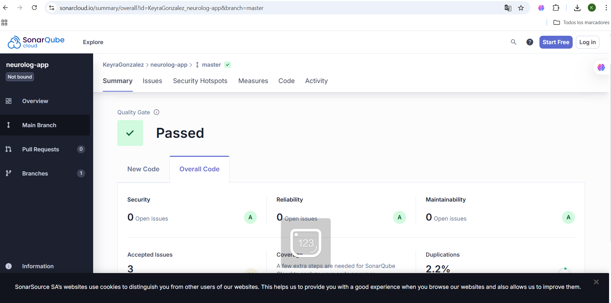

# NeuroLog - Registro Diario para Niños con NEE

## 📋 Descripción

NeuroLog es una aplicación web **open source** orientada al registro y seguimiento diario de comportamientos, emociones y avances de niños con necesidades educativas especiales (NEE). 

La aplicación facilita la colaboración entre padres, docentes y profesionales clínicos, centralizando la información de forma estructurada, segura y accesible mediante un sistema de roles diferenciados.

### ✨ Características principales:
- Registro diario de eventos categorizados (emociones, conductas, alimentación, atención, socialización)
- Visualización de patrones y tendencias con gráficos
- Sistema de roles para padres, docentes y especialistas
- Exportación de reportes en CSV/PDF
- Notificaciones y recordatorios automáticos
- Seguridad y privacidad de datos

## 🛠 Tecnologías

- **Frontend:** Next.js/React
- **Backend:** Supabase (PostgreSQL + Edge Functions)
- **Autenticación:** Supabase Auth
- **Tiempo real:** Supabase Realtime
- **Gráficos:** Chart.js/Recharts

## 📋 Requisitos del Sistema

- **Node.js:** v18.0.0 o superior
- **npm:** v8.0.0 o superior
- **Cuenta Supabase:** Gratuita

## 🚀 Instalación

### 1. Clonar el repositorio
```bash
git clone https://github.com/israelgo93/neurolog-app.git
cd neurolog-app
```

### 2. Instalar dependencias
```bash
npm install
```


### 4. Resultado de la solucion de errores de la pagina

